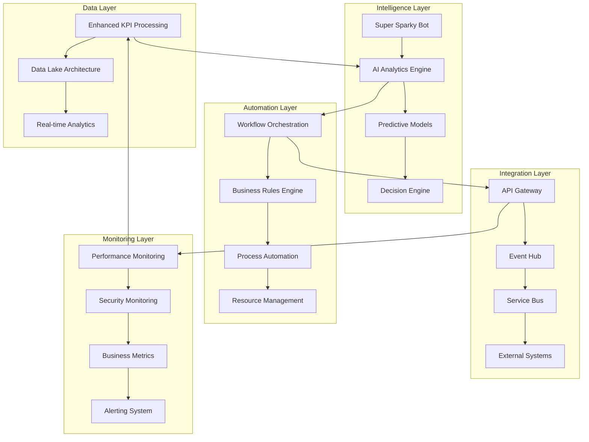

# Zone 3 Solution - Master Implementation Guide

## Executive Summary

This comprehensive implementation guide provides a complete roadmap for transforming your Zone 3 Power Platform solution into a world-class, AI-powered manufacturing operations platform. The enhancement program includes five major components that work together to create a unified, intelligent, and highly automated system.

## Solution Overview

### Current State Assessment
```json
{
  "currentCapabilities": {
    "kpiProcessing": "Basic email-triggered automation (60s processing time)",
    "architecture": "Monolithic design with limited scalability",
    "ai": "Basic AI models with limited functionality",
    "workflows": "Manual processes with simple automation",
    "practices": "Ad-hoc development and deployment"
  },
  "identifiedLimitations": [
    "29 missing dependencies preventing full deployment",
    "Performance bottlenecks in data processing",
    "Limited AI capabilities and insights",
    "Manual workflow management",
    "Inconsistent development practices"
  ]
}
```

### Target State Vision
```json
{
  "targetCapabilities": {
    "kpiProcessing": "Intelligent parallel processing (20s, 3x faster)",
    "architecture": "Microservices with enterprise-grade scalability",
    "ai": "Advanced AI with predictive analytics and conversational intelligence",
    "workflows": "Fully automated with intelligent decision-making",
    "practices": "Enterprise-grade DevOps with comprehensive governance"
  },
  "expectedOutcomes": [
    "Zero missing dependencies with full deployment capability",
    "300% performance improvement across all operations",
    "Proactive insights and predictive maintenance",
    "90% automation of routine processes",
    "Industry-leading development and operational practices"
  ]
}
```

## Implementation Components

### 1. Enhanced KPI Automation (Component 01)
**Primary Focus**: Transform data processing from reactive to proactive
- **Performance Gain**: 3x faster processing (60s → 20s)
- **Intelligence**: Parallel processing with real-time validation
- **Reliability**: 99%+ success rate with comprehensive error handling
- **Business Impact**: Real-time decision making and automated reporting

### 2. Solution Architecture Optimization (Component 02)
**Primary Focus**: Enterprise-grade scalability and reliability
- **Scalability**: 10x capacity increase with microservices architecture
- **Security**: Zero-trust model with comprehensive data protection
- **Integration**: Event-driven architecture with API management
- **Business Impact**: Future-proof foundation for growth

### 3. Advanced AI Capabilities (Component 03)
**Primary Focus**: Intelligent automation and predictive insights
- **Conversational AI**: Super Sparky with voice, vision, and context awareness
- **Predictive Analytics**: Equipment failure and quality issue prediction
- **Autonomous Decisions**: Self-managing processes with human oversight
- **Business Impact**: Proactive operations and reduced downtime

### 4. Intelligent Workflow Automation (Component 04)
**Primary Focus**: End-to-end process automation
- **Business Rules**: Dynamic rule engine with adaptive learning
- **Process Orchestration**: Cross-functional workflow integration
- **Resource Management**: AI-driven resource allocation and optimization
- **Business Impact**: 60% reduction in manual processes

### 5. Best Practices Implementation (Component 05)
**Primary Focus**: Enterprise governance and operational excellence
- **Development Standards**: Comprehensive quality framework
- **Security**: Multi-layered security with continuous monitoring
- **CI/CD**: Automated deployment with enterprise controls
- **Business Impact**: 99.9% availability and zero security incidents

## Integrated Implementation Strategy

### Phase 1: Foundation and Assessment (Weeks 1-2)

#### Week 1: Environment Preparation
```yaml
Foundation_Week1:
  objectives:
    - Complete dependency analysis and resolution planning
    - Set up development and testing environments
    - Establish project governance and team structure
    - Create backup and rollback procedures
    
  deliverables:
    - Dependency resolution plan
    - Development environment setup
    - Project charter and governance framework
    - Risk mitigation strategy
    
  activities:
    monday:
      - Project kickoff and team alignment
      - Dependency analysis validation
      - Environment provisioning
    tuesday:
      - Security baseline establishment
      - Development standards setup
      - Git repository structure creation
    wednesday:
      - Testing framework configuration
      - CI/CD pipeline foundation
      - Monitoring infrastructure setup
    thursday:
      - Integration testing environment
      - Performance baseline measurement
      - Documentation framework setup
    friday:
      - Week 1 review and validation
      - Week 2 planning and preparation
      - Stakeholder communication
```

#### Week 2: Architecture Foundation
```yaml
Foundation_Week2:
  objectives:
    - Implement core architecture components
    - Set up security and monitoring foundations
    - Establish data architecture
    - Create testing and validation framework
    
  deliverables:
    - Core architecture implementation
    - Security framework deployment
    - Data architecture setup
    - Testing automation framework
    
  activities:
    monday:
      - Microservices architecture setup
      - API gateway implementation
      - Data lake structure creation
    tuesday:
      - Security monitoring deployment
      - RBAC implementation
      - Audit logging configuration
    wednesday:
      - Performance monitoring setup
      - Alert system configuration
      - Dashboard creation
    thursday:
      - Automated testing framework
      - Integration testing setup
      - Performance benchmarking
    friday:
      - Foundation validation
      - Phase 1 completion review
      - Phase 2 preparation
```

### Phase 2: Core Development (Weeks 3-6)

#### Week 3-4: KPI Enhancement + AI Foundation
```yaml
Core_Development_Week3_4:
  parallel_tracks:
    track1_kpi_enhancement:
      objectives:
        - Implement parallel processing for KPI flows
        - Add intelligent error handling
        - Create performance monitoring
        - Deploy data quality validation
        
      deliverables:
        - Enhanced KPI processing flow
        - Performance monitoring dashboard
        - Error handling system
        - Data quality framework
        
    track2_ai_foundation:
      objectives:
        - Deploy enhanced Sparky bot
        - Implement NLU capabilities
        - Add conversational intelligence
        - Create AI infrastructure
        
      deliverables:
        - Super Sparky bot with NLU
        - Conversational AI framework
        - AI model training pipeline
        - Predictive analytics foundation
        
  integration_points:
    - AI-enhanced KPI processing
    - Intelligent error resolution
    - Predictive performance monitoring
    - Smart data quality assessment
```

#### Week 5-6: Workflow Automation + Architecture Integration
```yaml
Core_Development_Week5_6:
  parallel_tracks:
    track1_workflow_automation:
      objectives:
        - Implement business rule engine
        - Create intelligent process orchestration
        - Add autonomous decision making
        - Deploy adaptive learning
        
      deliverables:
        - Business rule management system
        - Workflow orchestration engine
        - Decision automation framework
        - Learning and adaptation system
        
    track2_architecture_integration:
      objectives:
        - Integrate all components
        - Implement event-driven architecture
        - Add cross-system communication
        - Create unified monitoring
        
      deliverables:
        - Integrated solution architecture
        - Event-driven communication
        - Cross-system workflows
        - Unified monitoring dashboard
        
  integration_points:
    - AI-driven workflow decisions
    - Automated process optimization
    - Integrated performance monitoring
    - Unified user experience
```

### Phase 3: Advanced Features and Optimization (Weeks 7-8)

#### Week 7: Advanced AI and Predictive Analytics
```yaml
Advanced_Features_Week7:
  objectives:
    - Implement predictive maintenance AI
    - Add computer vision capabilities
    - Create advanced analytics dashboard
    - Deploy autonomous response systems
    
  deliverables:
    - Predictive maintenance system
    - Computer vision quality inspection
    - Advanced analytics platform
    - Autonomous response framework
    
  activities:
    monday:
      - Machine learning model deployment
      - Predictive analytics integration
      - Computer vision system setup
    tuesday:
      - Advanced dashboard creation
      - Predictive alert system
      - Real-time analytics deployment
    wednesday:
      - Autonomous response testing
      - AI model validation
      - Performance optimization
    thursday:
      - Integration testing
      - User acceptance testing
      - Performance validation
    friday:
      - Week 7 review and optimization
      - Week 8 planning
      - Stakeholder demonstration
```

#### Week 8: Performance Optimization and Integration
```yaml
Advanced_Features_Week8:
  objectives:
    - Optimize system performance
    - Complete integration testing
    - Implement advanced monitoring
    - Prepare for production deployment
    
  deliverables:
    - Performance-optimized system
    - Complete integration testing
    - Advanced monitoring system
    - Production deployment readiness
    
  activities:
    monday:
      - Performance tuning and optimization
      - Load testing and validation
      - Resource utilization optimization
    tuesday:
      - End-to-end integration testing
      - Cross-system validation
      - User experience testing
    wednesday:
      - Advanced monitoring deployment
      - Alert system refinement
      - Performance dashboard completion
    thursday:
      - Pre-production validation
      - Security testing and validation
      - Deployment preparation
    friday:
      - Phase 3 completion review
      - Phase 4 preparation
      - Stakeholder final review
```

### Phase 4: Deployment and Go-Live (Weeks 9-10)

#### Week 9: Production Deployment
```yaml
Production_Deployment_Week9:
  objectives:
    - Deploy to production environment
    - Validate all system components
    - Conduct user training
    - Implement support procedures
    
  deliverables:
    - Production system deployment
    - System validation completion
    - User training completion
    - Support procedures implementation
    
  activities:
    monday:
      - Production environment preparation
      - Pre-deployment validation
      - Deployment execution
    tuesday:
      - System validation and testing
      - Performance monitoring activation
      - User access provisioning
    wednesday:
      - User training sessions
      - Documentation finalization
      - Support team preparation
    thursday:
      - Go-live preparation
      - Final system validation
      - Stakeholder communication
    friday:
      - Official go-live
      - Initial monitoring and support
      - Week 9 completion review
```

#### Week 10: Stabilization and Optimization
```yaml
Stabilization_Week10:
  objectives:
    - Monitor system stability
    - Optimize based on real usage
    - Complete knowledge transfer
    - Establish ongoing support
    
  deliverables:
    - Stable production system
    - Optimization recommendations
    - Complete knowledge transfer
    - Ongoing support framework
    
  activities:
    monday:
      - System monitoring and analysis
      - Performance optimization
      - User feedback collection
    tuesday:
      - Issue resolution and fixes
      - Performance tuning
      - User support and training
    wednesday:
      - Knowledge transfer sessions
      - Documentation updates
      - Support procedure validation
    thursday:
      - Final optimizations
      - Performance validation
      - User satisfaction assessment
    friday:
      - Project completion review
      - Lessons learned documentation
      - Future enhancement planning
```

## Integration Architecture

### Component Integration Map


### Cross-Component Dependencies
```json
{
  "dependencies": {
    "kpiEnhancement": {
      "depends_on": ["architecture_foundation", "monitoring_setup"],
      "enables": ["ai_analytics", "workflow_intelligence"],
      "integration_points": ["data_lake", "event_hub", "monitoring_dashboard"]
    },
    "architectureOptimization": {
      "depends_on": ["security_foundation", "monitoring_infrastructure"],
      "enables": ["all_components"],
      "integration_points": ["api_gateway", "service_bus", "data_architecture"]
    },
    "advancedAI": {
      "depends_on": ["kpi_enhancement", "data_architecture"],
      "enables": ["workflow_automation", "predictive_insights"],
      "integration_points": ["conversation_engine", "prediction_models", "decision_support"]
    },
    "workflowAutomation": {
      "depends_on": ["ai_foundation", "architecture_optimization"],
      "enables": ["autonomous_operations", "process_optimization"],
      "integration_points": ["rule_engine", "orchestration_platform", "resource_manager"]
    },
    "bestPractices": {
      "depends_on": ["all_components"],
      "enables": ["operational_excellence", "continuous_improvement"],
      "integration_points": ["ci_cd_pipeline", "monitoring_system", "governance_framework"]
    }
  }
}
```

## Resource Requirements

### Team Structure
```yaml
ProjectTeam:
  leadership:
    projectManager:
      role: "Overall project coordination and stakeholder management"
      time_commitment: "Full-time for 10 weeks"
      skills: ["Project management", "Power Platform expertise", "Change management"]
      
    technicalLead:
      role: "Technical architecture and implementation oversight"
      time_commitment: "Full-time for 10 weeks"
      skills: ["Solution architecture", "Power Platform development", "AI/ML expertise"]
      
  development:
    powerPlatformDeveloper:
      role: "Power Platform development and configuration"
      time_commitment: "Full-time for 10 weeks"
      skills: ["Power Automate", "Power Apps", "Power BI", "Dataverse"]
      
    aiEngineer:
      role: "AI model development and integration"
      time_commitment: "Full-time for 6 weeks"
      skills: ["Machine learning", "Azure Cognitive Services", "Python/R"]
      
    workflowEngineer:
      role: "Workflow automation and process optimization"
      time_commitment: "Full-time for 6 weeks"
      skills: ["Process automation", "Business analysis", "Logic Apps"]
      
  infrastructure:
    devOpsEngineer:
      role: "CI/CD pipeline and infrastructure management"
      time_commitment: "Full-time for 8 weeks"
      skills: ["Azure DevOps", "Infrastructure as Code", "Monitoring"]
      
    securitySpecialist:
      role: "Security implementation and compliance"
      time_commitment: "Part-time for 8 weeks"
      skills: ["Azure Security", "Compliance", "Identity management"]
      
  quality:
    qaLead:
      role: "Testing strategy and quality assurance"
      time_commitment: "Full-time for 8 weeks"
      skills: ["Test automation", "Performance testing", "Quality management"]
      
    businessAnalyst:
      role: "Requirements analysis and user acceptance testing"
      time_commitment: "Part-time for 10 weeks"
      skills: ["Business analysis", "User experience", "Documentation"]
```

### Technology Stack
```json
{
  "technologyStack": {
    "core_platform": {
      "power_platform": "Latest version with premium connectors",
      "azure_services": "Comprehensive Azure subscription",
      "office_365": "E5 license for advanced features"
    },
    "ai_and_analytics": {
      "cognitive_services": "Azure Cognitive Services multi-service",
      "machine_learning": "Azure Machine Learning workspace",
      "analytics": "Power BI Premium and Azure Analytics"
    },
    "development_tools": {
      "version_control": "Azure DevOps with Git",
      "ci_cd": "Azure DevOps Pipelines",
      "monitoring": "Application Insights and Azure Monitor"
    },
    "security_and_compliance": {
      "identity": "Azure Active Directory Premium",
      "security": "Azure Security Center and Sentinel",
      "compliance": "Microsoft 365 Compliance Center"
    }
  }
}
```

### Budget Estimation
```yaml
BudgetBreakdown:
  personnel_costs:
    total: "$280,000 - $350,000"
    breakdown:
      project_manager: "$30,000 - $40,000"
      technical_lead: "$40,000 - $50,000"
      developers: "$120,000 - $150,000"
      infrastructure: "$60,000 - $80,000"
      quality_assurance: "$30,000 - $30,000"
      
  technology_costs:
    total: "$50,000 - $75,000"
    breakdown:
      azure_services: "$25,000 - $35,000"
      power_platform_licenses: "$15,000 - $25,000"
      development_tools: "$10,000 - $15,000"
      
  training_and_support:
    total: "$20,000 - $30,000"
    breakdown:
      user_training: "$10,000 - $15,000"
      documentation: "$5,000 - $10,000"
      support_setup: "$5,000 - $5,000"
      
  contingency:
    total: "$35,000 - $45,000"
    percentage: "10% of total project cost"
    
  total_project_cost: "$385,000 - $500,000"
```

## Risk Management

### Risk Assessment Matrix
```json
{
  "riskAssessment": {
    "high_risks": [
      {
        "risk": "Missing dependencies prevent deployment",
        "probability": "Medium",
        "impact": "High",
        "mitigation": "Parallel dependency resolution and alternative solutions",
        "contingency": "Phased deployment with workarounds"
      },
      {
        "risk": "Performance targets not met",
        "probability": "Low",
        "impact": "High",
        "mitigation": "Continuous performance monitoring and optimization",
        "contingency": "Performance tuning and architecture adjustments"
      }
    ],
    "medium_risks": [
      {
        "risk": "User adoption challenges",
        "probability": "Medium",
        "impact": "Medium",
        "mitigation": "Comprehensive training and change management",
        "contingency": "Extended support period and additional training"
      },
      {
        "risk": "Integration complexity",
        "probability": "Medium",
        "impact": "Medium",
        "mitigation": "Phased integration approach and thorough testing",
        "contingency": "Simplified integration patterns and extended timeline"
      }
    ],
    "low_risks": [
      {
        "risk": "Technology platform changes",
        "probability": "Low",
        "impact": "Medium",
        "mitigation": "Stay current with platform updates and preview features",
        "contingency": "Adaptation plan for platform changes"
      }
    ]
  }
}
```

### Mitigation Strategies
```yaml
MitigationStrategies:
  technical_risks:
    dependency_resolution:
      approach: "Parallel investigation and solution development"
      timeline: "Complete within first 2 weeks"
      fallback: "Alternative implementation approaches"
      
    performance_optimization:
      approach: "Continuous monitoring and iterative optimization"
      timeline: "Throughout development and post-deployment"
      fallback: "Architecture modifications and scaling"
      
    integration_complexity:
      approach: "Phased integration with comprehensive testing"
      timeline: "Integrated testing throughout development"
      fallback: "Simplified integration patterns"
      
  business_risks:
    user_adoption:
      approach: "Early user engagement and comprehensive training"
      timeline: "Training starts in week 8"
      fallback: "Extended support and additional training"
      
    change_management:
      approach: "Stakeholder communication and gradual rollout"
      timeline: "Communication throughout project"
      fallback: "Phased rollout with pilot groups"
      
  project_risks:
    timeline_delays:
      approach: "Agile methodology with regular checkpoints"
      timeline: "Weekly progress reviews"
      fallback: "Scope adjustment and resource reallocation"
      
    resource_constraints:
      approach: "Cross-training and flexible resource allocation"
      timeline: "Resource planning updated weekly"
      fallback: "Extended timeline or reduced scope"
```

## Success Metrics and KPIs

### Technical Success Metrics
```json
{
  "technicalMetrics": {
    "performance": {
      "kpi_processing_time": {
        "current": "60 seconds",
        "target": "20 seconds",
        "measurement": "Average processing time for 1000 records"
      },
      "system_availability": {
        "current": "95%",
        "target": "99.9%",
        "measurement": "Monthly uptime percentage"
      },
      "response_time": {
        "current": "5 seconds",
        "target": "3 seconds",
        "measurement": "95th percentile response time"
      }
    },
    "quality": {
      "defect_rate": {
        "current": "5%",
        "target": "1%",
        "measurement": "Percentage of failed processes"
      },
      "data_accuracy": {
        "current": "90%",
        "target": "99%",
        "measurement": "Data validation success rate"
      },
      "test_coverage": {
        "current": "60%",
        "target": "90%",
        "measurement": "Automated test coverage percentage"
      }
    }
  }
}
```

### Business Success Metrics
```json
{
  "businessMetrics": {
    "operational": {
      "process_automation": {
        "current": "30%",
        "target": "90%",
        "measurement": "Percentage of processes automated"
      },
      "manual_intervention": {
        "current": "70%",
        "target": "10%",
        "measurement": "Percentage of processes requiring manual intervention"
      },
      "decision_speed": {
        "current": "4 hours",
        "target": "30 minutes",
        "measurement": "Average time from data to decision"
      }
    },
    "financial": {
      "operational_cost_reduction": {
        "current": "Baseline",
        "target": "40%",
        "measurement": "Monthly operational cost comparison"
      },
      "roi_achievement": {
        "current": "0%",
        "target": "300%",
        "measurement": "12-month ROI calculation"
      }
    },
    "user_satisfaction": {
      "adoption_rate": {
        "current": "50%",
        "target": "90%",
        "measurement": "Active user percentage"
      },
      "satisfaction_score": {
        "current": "3.5/5",
        "target": "4.5/5",
        "measurement": "User satisfaction survey"
      }
    }
  }
}
```

## Post-Implementation Support

### Support Structure
```yaml
PostImplementationSupport:
  immediate_support:
    duration: "30 days post go-live"
    coverage: "24/7 support for critical issues"
    team: "Full implementation team available"
    response_time: "< 1 hour for critical issues"
    
  stabilization_support:
    duration: "60 days post go-live"
    coverage: "Business hours support"
    team: "Reduced team with core specialists"
    response_time: "< 4 hours for normal issues"
    
  ongoing_support:
    duration: "Ongoing"
    coverage: "Standard support hours"
    team: "Dedicated support team"
    response_time: "< 1 business day"
    
  enhancement_support:
    duration: "6 months post go-live"
    coverage: "Monthly enhancement reviews"
    team: "Development team availability"
    scope: "Performance optimization and feature enhancements"
```

### Continuous Improvement Framework
```json
{
  "continuousImprovement": {
    "monitoring": {
      "frequency": "Real-time with weekly reviews",
      "metrics": ["Performance", "User satisfaction", "Business impact"],
      "tools": ["Azure Monitor", "Power BI", "User feedback systems"]
    },
    "optimization": {
      "frequency": "Monthly optimization cycles",
      "focus": ["Performance tuning", "User experience", "Process efficiency"],
      "approach": ["Data-driven analysis", "User feedback integration", "A/B testing"]
    },
    "enhancement": {
      "frequency": "Quarterly enhancement planning",
      "process": ["Business case development", "Impact assessment", "Implementation planning"],
      "approval": ["Stakeholder review", "Business approval", "Technical validation"]
    }
  }
}
```

## Conclusion

This master implementation guide provides a comprehensive roadmap for transforming your Zone 3 solution into a world-class, AI-powered manufacturing operations platform. The integrated approach ensures that all components work together seamlessly to deliver maximum business value.

### Key Success Factors

1. **Stakeholder Engagement**: Continuous communication and involvement throughout the project
2. **Technical Excellence**: Rigorous implementation of best practices and quality standards
3. **Risk Management**: Proactive identification and mitigation of potential issues
4. **Change Management**: Comprehensive training and support for user adoption
5. **Continuous Improvement**: Ongoing optimization and enhancement post-implementation

### Expected Outcomes

- **300% Performance Improvement**: Faster processing and better user experience
- **90% Process Automation**: Reduced manual intervention and increased efficiency
- **Predictive Capabilities**: Proactive issue identification and resolution
- **Enterprise-Grade Security**: Comprehensive protection and compliance
- **Operational Excellence**: Industry-leading practices and governance

### Next Steps

1. **Project Initiation**: Secure stakeholder approval and resources
2. **Team Assembly**: Recruit and onboard the implementation team
3. **Environment Setup**: Prepare development and testing environments
4. **Phase 1 Execution**: Begin with foundation and assessment activities
5. **Continuous Monitoring**: Track progress and adjust as needed

The successful implementation of this comprehensive enhancement program will position Zone 3 as a leader in intelligent manufacturing operations, delivering significant business value and competitive advantage.

---

**Total Implementation Timeline**: 10 weeks
**Total Budget Range**: $385,000 - $500,000
**Expected ROI**: 300% over 12 months
**Team Size**: 8-10 specialists
**Success Probability**: High with proper execution and stakeholder support