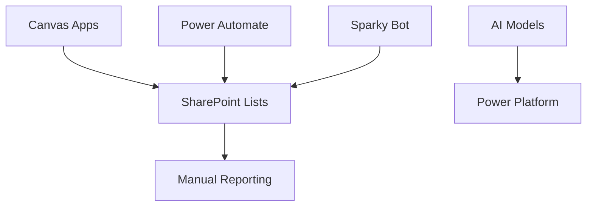
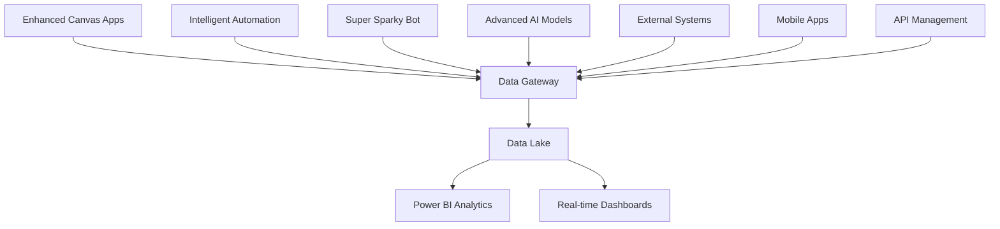

# Solution Architecture Optimization Guide

## Overview

This guide provides a comprehensive approach to optimizing the Zone 3 Power Platform solution architecture for scalability, performance, security, and maintainability.

## Current Architecture Assessment

### Current State


### Target Architecture


## Architecture Optimization Strategy

### 1. Data Architecture Enhancement

#### 1.1 Implement Data Lake Architecture
```json
{
  "dataLakeStructure": {
    "rawData": {
      "location": "SharePoint/Raw",
      "retention": "2 years",
      "format": "Native format (Excel, CSV, JSON)"
    },
    "processedData": {
      "location": "SharePoint/Processed", 
      "retention": "5 years",
      "format": "Standardized JSON/Parquet"
    },
    "analyticsData": {
      "location": "Power BI Dataset",
      "retention": "10 years",
      "format": "Optimized for analytics"
    }
  }
}
```

#### 1.2 Data Flow Optimization
```powershell
# Create optimized data flow structure
$DataFlowStages = @{
    "Ingestion" = @{
        "Sources" = @("Email attachments", "Manual uploads", "API feeds")
        "Validation" = "Schema validation, data type checking"
        "Storage" = "Raw data lake tier"
    }
    "Processing" = @{
        "Transformation" = "Data cleansing, enrichment, calculation"
        "Quality" = "Data quality scoring and reporting"
        "Storage" = "Processed data lake tier"
    }
    "Analytics" = @{
        "Aggregation" = "KPI calculation, trend analysis"
        "Visualization" = "Real-time dashboards, reports"
        "Storage" = "Analytics-optimized storage"
    }
}
```

### 2. Application Architecture Enhancement

#### 2.1 Microservices Pattern Implementation
```json
{
  "microservices": {
    "dataIngestionService": {
      "responsibility": "Handle all data ingestion",
      "technology": "Power Automate + Custom APIs",
      "scalability": "Auto-scaling based on volume"
    },
    "dataProcessingService": {
      "responsibility": "Data transformation and quality",
      "technology": "Power Automate + AI Builder",
      "scalability": "Parallel processing"
    },
    "analyticsService": {
      "responsibility": "KPI calculation and reporting",
      "technology": "Power BI + Custom visuals",
      "scalability": "Incremental refresh"
    },
    "notificationService": {
      "responsibility": "Alerts and notifications",
      "technology": "Power Automate + Teams/Email",
      "scalability": "Queue-based processing"
    }
  }
}
```

#### 2.2 API Gateway Implementation
```json
{
  "apiGateway": {
    "purpose": "Centralized API management and security",
    "features": [
      "Rate limiting",
      "Authentication/Authorization",
      "Request/Response logging",
      "API versioning",
      "Load balancing"
    ],
    "implementation": {
      "technology": "Azure API Management",
      "integration": "Power Platform Custom Connectors",
      "security": "OAuth 2.0 + API Keys"
    }
  }
}
```

### 3. Security Architecture Enhancement

#### 3.1 Zero Trust Security Model
```json
{
  "zeroTrustPrinciples": {
    "verifyExplicitly": {
      "implementation": [
        "Multi-factor authentication for all users",
        "Device compliance checking",
        "Location-based access controls"
      ]
    },
    "leastPrivilegeAccess": {
      "implementation": [
        "Role-based access control (RBAC)",
        "Just-in-time access for admin tasks",
        "Regular access reviews"
      ]
    },
    "assumeBreach": {
      "implementation": [
        "Data encryption at rest and in transit",
        "Activity monitoring and alerting",
        "Incident response automation"
      ]
    }
  }
}
```

#### 3.2 Data Protection Strategy
```powershell
# Implement comprehensive data protection
$DataProtectionLayers = @{
    "Classification" = @{
        "Public" = "Zone 3 general information"
        "Internal" = "Operational data and KPIs"
        "Confidential" = "Financial and strategic data"
        "Restricted" = "Personal and sensitive data"
    }
    "Encryption" = @{
        "AtRest" = "AES-256 encryption for SharePoint"
        "InTransit" = "TLS 1.3 for all communications"
        "InUse" = "Azure Confidential Computing"
    }
    "AccessControl" = @{
        "Authentication" = "Azure AD with MFA"
        "Authorization" = "RBAC with conditional access"
        "Auditing" = "Comprehensive audit logging"
    }
}
```

### 4. Integration Architecture Enhancement

#### 4.1 Enterprise Service Bus Pattern
```json
{
  "serviceBus": {
    "purpose": "Decouple applications and enable scalable integration",
    "components": {
      "messageQueue": "Azure Service Bus for async processing",
      "eventHub": "Real-time event streaming",
      "apiManagement": "Centralized API gateway",
      "dataSync": "Bidirectional data synchronization"
    },
    "benefits": [
      "Loose coupling between components",
      "Improved fault tolerance",
      "Better scalability",
      "Easier maintenance"
    ]
  }
}
```

#### 4.2 Event-Driven Architecture
```json
{
  "eventDrivenPattern": {
    "events": {
      "dataReceived": "Triggered when new data arrives",
      "processingComplete": "Triggered when processing finishes",
      "errorOccurred": "Triggered on system errors",
      "thresholdExceeded": "Triggered when KPIs exceed limits"
    },
    "handlers": {
      "dataReceived": ["Start processing flow", "Log receipt"],
      "processingComplete": ["Update dashboards", "Send notifications"],
      "errorOccurred": ["Log error", "Trigger recovery", "Alert admin"],
      "thresholdExceeded": ["Send alerts", "Escalate to management"]
    }
  }
}
```

### 5. Performance Optimization

#### 5.1 Caching Strategy
```json
{
  "cachingLayers": {
    "browserCache": {
      "scope": "Canvas app static resources",
      "duration": "24 hours",
      "implementation": "Browser caching headers"
    },
    "applicationCache": {
      "scope": "Frequently accessed data",
      "duration": "15 minutes",
      "implementation": "Power Platform caching"
    },
    "dataCache": {
      "scope": "Processed KPI data",
      "duration": "1 hour",
      "implementation": "Power BI dataset cache"
    }
  }
}
```

#### 5.2 Load Balancing and Scaling
```json
{
  "scalingStrategy": {
    "horizontal": {
      "implementation": "Multiple flow instances",
      "trigger": "Queue depth > 100 items",
      "maximum": "10 concurrent instances"
    },
    "vertical": {
      "implementation": "Premium connectors",
      "trigger": "Performance degradation",
      "resources": "Increased API call limits"
    },
    "auto": {
      "implementation": "Dynamic scaling based on demand",
      "metrics": ["Queue depth", "Processing time", "Error rate"],
      "actions": ["Scale out", "Scale up", "Alert admin"]
    }
  }
}
```

### 6. Monitoring and Observability

#### 6.1 Comprehensive Monitoring Stack
```json
{
  "monitoringStack": {
    "applicationPerformance": {
      "tool": "Application Insights",
      "metrics": ["Response time", "Error rate", "Throughput"],
      "alerts": "Performance degradation detection"
    },
    "businessMetrics": {
      "tool": "Power BI",
      "metrics": ["KPI trends", "Data quality", "User adoption"],
      "alerts": "Business threshold violations"
    },
    "infrastructure": {
      "tool": "Azure Monitor",
      "metrics": ["Resource utilization", "Availability", "Cost"],
      "alerts": "Infrastructure issues"
    }
  }
}
```

#### 6.2 Logging and Auditing
```powershell
# Implement comprehensive logging strategy
$LoggingStrategy = @{
    "ApplicationLogs" = @{
        "Level" = "Information, Warning, Error, Critical"
        "Retention" = "90 days"
        "Location" = "Application Insights"
    }
    "AuditLogs" = @{
        "Level" = "All user actions and system events"
        "Retention" = "7 years"
        "Location" = "Azure Sentinel"
    }
    "PerformanceLogs" = @{
        "Level" = "Detailed performance metrics"
        "Retention" = "30 days"
        "Location" = "Performance monitoring dashboard"
    }
}
```

## Implementation Roadmap

### Phase 1: Foundation (Weeks 1-2)
1. **Data Architecture Setup**
   - Implement data lake structure
   - Set up data classification
   - Configure encryption

2. **Security Baseline**
   - Deploy zero trust model
   - Implement RBAC
   - Set up audit logging

### Phase 2: Core Optimization (Weeks 3-4)
1. **Application Architecture**
   - Implement microservices pattern
   - Deploy API gateway
   - Set up event-driven architecture

2. **Performance Optimization**
   - Implement caching strategy
   - Configure load balancing
   - Optimize data flows

### Phase 3: Advanced Features (Weeks 5-6)
1. **Integration Enhancement**
   - Deploy service bus
   - Implement real-time events
   - Connect external systems

2. **Monitoring and Observability**
   - Deploy monitoring stack
   - Configure alerting
   - Set up dashboards

### Phase 4: Optimization and Tuning (Weeks 7-8)
1. **Performance Tuning**
   - Optimize based on metrics
   - Fine-tune scaling parameters
   - Improve cache hit rates

2. **Security Hardening**
   - Security review and updates
   - Penetration testing
   - Compliance validation

## Architecture Patterns and Best Practices

### 1. Design Patterns

#### 1.1 Circuit Breaker Pattern
```json
{
  "circuitBreaker": {
    "purpose": "Prevent cascade failures",
    "implementation": {
      "failureThreshold": 5,
      "timeout": "30 seconds",
      "recoveryTimeout": "60 seconds"
    },
    "states": ["Closed", "Open", "Half-Open"]
  }
}
```

#### 1.2 Retry Pattern
```json
{
  "retryPattern": {
    "strategy": "Exponential backoff",
    "maxRetries": 3,
    "baseDelay": "1 second",
    "maxDelay": "30 seconds",
    "jitter": true
  }
}
```

#### 1.3 Bulkhead Pattern
```json
{
  "bulkheadPattern": {
    "purpose": "Isolate critical resources",
    "implementation": {
      "criticalFlows": "Dedicated execution pool",
      "normalFlows": "Shared execution pool",
      "adminFlows": "Reserved execution pool"
    }
  }
}
```

### 2. Data Patterns

#### 2.1 Command Query Responsibility Segregation (CQRS)
```json
{
  "cqrs": {
    "commands": {
      "purpose": "Write operations",
      "optimization": "Write-optimized data store",
      "examples": ["Create KPI entry", "Update task status"]
    },
    "queries": {
      "purpose": "Read operations", 
      "optimization": "Read-optimized data store",
      "examples": ["Get dashboard data", "Generate reports"]
    }
  }
}
```

#### 2.2 Event Sourcing
```json
{
  "eventSourcing": {
    "purpose": "Complete audit trail of all changes",
    "implementation": {
      "eventStore": "Azure Event Hub",
      "snapshots": "Periodic state snapshots",
      "replay": "Ability to reconstruct state"
    }
  }
}
```

## Quality Attributes

### 1. Performance
- **Response Time**: < 3 seconds for 95% of requests
- **Throughput**: 1000+ requests per minute
- **Scalability**: Linear scaling up to 10x current load

### 2. Reliability
- **Availability**: 99.9% uptime
- **Fault Tolerance**: Graceful degradation under load
- **Recovery**: < 5 minutes recovery time

### 3. Security
- **Authentication**: Multi-factor authentication
- **Authorization**: Role-based access control
- **Data Protection**: Encryption at rest and in transit

### 4. Maintainability
- **Modularity**: Loosely coupled components
- **Testability**: Comprehensive test coverage
- **Deployability**: Automated deployment pipeline

## Migration Strategy

### 1. Parallel Run Approach
```json
{
  "migrationPhases": {
    "preparation": {
      "duration": "1 week",
      "activities": ["Setup new architecture", "Data migration", "Testing"]
    },
    "parallelRun": {
      "duration": "2 weeks", 
      "activities": ["Run both systems", "Compare results", "Fix issues"]
    },
    "cutover": {
      "duration": "1 day",
      "activities": ["Switch traffic", "Monitor", "Rollback if needed"]
    }
  }
}
```

### 2. Risk Mitigation
```json
{
  "riskMitigation": {
    "dataLoss": "Continuous backup and sync",
    "downtime": "Blue-green deployment",
    "performance": "Load testing before cutover",
    "rollback": "Automated rollback procedures"
  }
}
```

## Success Metrics

### Technical Metrics
- **Performance**: 50% improvement in response times
- **Reliability**: 99.9% availability achievement
- **Scalability**: 10x scaling capability
- **Security**: Zero security incidents

### Business Metrics
- **User Satisfaction**: > 95% satisfaction score
- **Productivity**: 40% reduction in manual tasks
- **Cost**: 30% reduction in operational costs
- **Time to Market**: 50% faster feature delivery

---

**Implementation Timeline**: 8 weeks
**Team Required**: Architect, 2 Developers, DevOps Engineer
**Budget Estimate**: $50,000 - $75,000
**ROI Expected**: 300% over 12 months