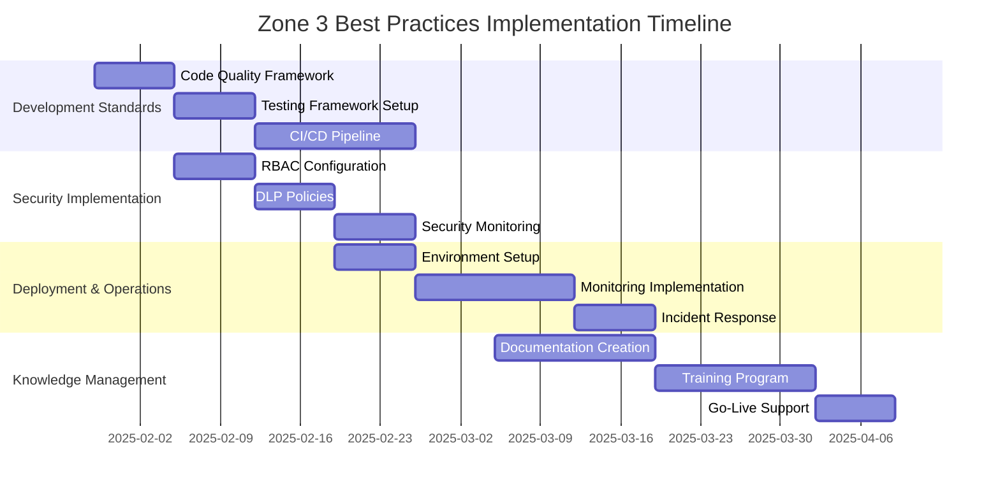

# Power Platform Best Practices Implementation Guide

## Overview

This comprehensive guide establishes enterprise-grade best practices for developing, deploying, and maintaining the Zone 3 Power Platform solution, ensuring scalability, security, maintainability, and operational excellence.

## Development Best Practices

### 1.1 Solution Architecture Standards

#### Solution Structure and Organization
```json
{
  "solutionStructure": {
    "namingConventions": {
      "solutions": "ProjectName_Environment_Version (e.g., Zone3_Prod_v1.2.0)",
      "flows": "ProcessName_Action_Version (e.g., KPICapture_Process_v2.0)",
      "apps": "AppType_Purpose_Device (e.g., Canvas_SafetyReporting_Mobile)",
      "connectors": "SystemName_Purpose_Version (e.g., SharePoint_DataSync_v1.0)",
      "variables": "camelCase for local, PascalCase for environment"
    },
    "componentOrganization": {
      "coreComponents": "Essential business logic and data operations",
      "uiComponents": "User interface and experience elements", 
      "integrationComponents": "External system connections and APIs",
      "utilityComponents": "Shared utilities and helper functions"
    },
    "versioningStrategy": {
      "semantic": "Major.Minor.Patch (e.g., 2.1.3)",
      "branching": "GitFlow with feature/hotfix/release branches",
      "dependencies": "Pin specific versions for production stability"
    }
  }
}
```

#### Development Environment Setup
```powershell
# Development Environment Configuration Script
# Zone3-DevEnvironment-Setup.ps1

param(
    [Parameter(Mandatory=$true)]
    [string]$EnvironmentName,
    
    [Parameter(Mandatory=$true)]
    [string]$DeveloperEmail
)

# Install required tools
Write-Host "Installing Power Platform CLI..." -ForegroundColor Green
winget install Microsoft.PowerPlatformCLI

# Install Git and set up configuration
Write-Host "Configuring Git..." -ForegroundColor Green
git config --global user.name "Zone3 Developer"
git config --global user.email $DeveloperEmail
git config --global init.defaultBranch main

# Set up development environment standards
$DevStandards = @{
    "CodeFormatting" = @{
        "Indentation" = "2 spaces for JSON, 4 spaces for PowerShell"
        "LineEndings" = "LF (Unix-style)"
        "MaxLineLength" = "120 characters"
        "FileEncoding" = "UTF-8"
    }
    "NamingConventions" = @{
        "Variables" = "camelCase"
        "Functions" = "PascalCase" 
        "Constants" = "UPPER_CASE"
        "Files" = "kebab-case"
    }
}

# Create project structure
$ProjectFolders = @(
    "src/flows",
    "src/apps", 
    "src/connectors",
    "tests/unit",
    "tests/integration",
    "docs/architecture",
    "docs/deployment",
    "config/environments"
)

foreach ($Folder in $ProjectFolders) {
    New-Item -ItemType Directory -Path $Folder -Force
    Write-Host "Created folder: $Folder" -ForegroundColor Cyan
}

Write-Host "Development environment setup complete!" -ForegroundColor Green
```

### 1.2 Code Quality Standards

#### Power Automate Flow Best Practices
```json
{
  "flowBestPractices": {
    "errorHandling": {
      "mandatoryTryCatch": "All API calls must be wrapped in try-catch",
      "specificErrorMessages": "Provide meaningful error descriptions",
      "errorLogging": "Log all errors to centralized logging system",
      "fallbackStrategies": "Define fallback actions for each critical step"
    },
    "performance": {
      "parallelExecution": "Use parallel branches for independent operations",
      "batchOperations": "Batch API calls when possible (max 100 items)",
      "conditionalExecution": "Use conditions to avoid unnecessary operations",
      "variableOptimization": "Minimize variable scope and reuse"
    },
    "maintainability": {
      "modularDesign": "Break complex flows into smaller, reusable components",
      "documentation": "Document each action's purpose and dependencies",
      "configurationDriven": "Use environment variables for configuration",
      "versionControl": "Track all changes with descriptive commit messages"
    }
  }
}
```

#### Canvas App Development Standards
```json
{
  "canvasAppStandards": {
    "codeStructure": {
      "formulaComplexity": "Max 3 nested functions per formula",
      "variableNaming": "Descriptive names with type prefixes (str, num, bool)",
      "codeReuse": "Create component library for common functions",
      "commentingStandard": "Comment all complex formulas and business logic"
    },
    "performanceOptimization": {
      "dataLoading": "Implement lazy loading for large datasets",
      "imageSizes": "Optimize images to <500KB, use web formats",
      "controlLimits": "Max 500 controls per screen",
      "delegableFilters": "Use delegable functions for data filtering"
    },
    "userExperience": {
      "responsiveDesign": "Design for multiple screen sizes",
      "loadingIndicators": "Show progress for long-running operations",
      "errorHandling": "User-friendly error messages with recovery options",
      "accessibility": "Follow WCAG 2.1 AA standards"
    }
  }
}
```

### 1.3 Testing Framework

#### Comprehensive Testing Strategy
```yaml
# Testing Framework Configuration
TestingStrategy:
  unitTesting:
    scope: "Individual components and functions"
    coverage: "Minimum 80% code coverage"
    tools: ["Power Platform Test Framework", "Custom test harness"]
    
    testCategories:
      dataValidation:
        tests: ["Input validation", "Data type checking", "Range validation"]
        frequency: "Every commit"
        
      businessLogic:
        tests: ["Calculation accuracy", "Rule evaluation", "Workflow logic"]
        frequency: "Every build"
        
      errorHandling:
        tests: ["Exception scenarios", "Fallback mechanisms", "Recovery procedures"]
        frequency: "Every release"
  
  integrationTesting:
    scope: "Component interactions and external integrations"
    coverage: "All integration points"
    tools: ["Postman", "Azure DevOps Test Plans", "Custom automation"]
    
    testCategories:
      apiIntegration:
        tests: ["SharePoint connectivity", "Office 365 integration", "Custom API calls"]
        frequency: "Daily"
        
      dataFlow:
        tests: ["End-to-end data flow", "Data transformation", "Error propagation"]
        frequency: "Every build"
        
      performanceLoad:
        tests: ["Concurrent user load", "Data volume testing", "Response time validation"]
        frequency: "Weekly"

  userAcceptanceTesting:
    scope: "Business scenario validation"
    coverage: "All user stories and acceptance criteria"
    tools: ["Manual testing", "Automated UI testing", "User feedback tools"]
    
    testCategories:
      functionalTesting:
        tests: ["Business process workflows", "User interface validation", "Report accuracy"]
        frequency: "Every sprint"
        
      usabilityTesting:
        tests: ["User experience validation", "Accessibility compliance", "Mobile responsiveness"]
        frequency: "Every release"
```

#### Automated Testing Implementation
```powershell
# Automated Testing Script
# Zone3-AutomatedTesting.ps1

param(
    [string]$TestSuite = "All",
    [string]$Environment = "Test"
)

function Invoke-PowerAutomateTests {
    param([string]$FlowName, [string]$TestType)
    
    Write-Host "Testing Power Automate Flow: $FlowName" -ForegroundColor Yellow
    
    $TestResults = @{
        FlowName = $FlowName
        TestType = $TestType
        Results = @()
    }
    
    # Test flow execution
    try {
        $FlowRun = pac flow run --name $FlowName --input-file "tests/data/sample-input.json"
        $TestResults.Results += @{
            Test = "Flow Execution"
            Status = "Passed"
            Duration = $FlowRun.Duration
        }
    }
    catch {
        $TestResults.Results += @{
            Test = "Flow Execution" 
            Status = "Failed"
            Error = $_.Exception.Message
        }
    }
    
    # Test error handling
    try {
        $ErrorTest = pac flow run --name $FlowName --input-file "tests/data/error-input.json"
        $TestResults.Results += @{
            Test = "Error Handling"
            Status = if ($ErrorTest.Status -eq "Failed") { "Passed" } else { "Failed" }
        }
    }
    catch {
        $TestResults.Results += @{
            Test = "Error Handling"
            Status = "Failed"
            Error = $_.Exception.Message
        }
    }
    
    return $TestResults
}

function Invoke-CanvasAppTests {
    param([string]$AppName, [string]$TestType)
    
    Write-Host "Testing Canvas App: $AppName" -ForegroundColor Yellow
    
    # Performance testing
    $PerformanceTest = @{
        AppLoadTime = Measure-Command { pac canvas app start --name $AppName }
        MemoryUsage = Get-Process -Name "PowerApps*" | Measure-Object WorkingSet -Sum
    }
    
    # Accessibility testing
    $AccessibilityResults = Test-AppAccessibility -AppName $AppName
    
    return @{
        AppName = $AppName
        Performance = $PerformanceTest
        Accessibility = $AccessibilityResults
        Status = "Completed"
    }
}

# Execute test suites
switch ($TestSuite) {
    "PowerAutomate" {
        $FlowTests = @("AutomatedKPICapture", "SafetyIncidentFlow", "MaintenanceWorkflow")
        foreach ($Flow in $FlowTests) {
            Invoke-PowerAutomateTests -FlowName $Flow -TestType "Integration"
        }
    }
    "CanvasApps" {
        $AppTests = @("Zone3ProjectManager", "SafetyFocusTime")
        foreach ($App in $AppTests) {
            Invoke-CanvasAppTests -AppName $App -TestType "UI"
        }
    }
    "All" {
        Write-Host "Running comprehensive test suite..." -ForegroundColor Green
        # Run all tests
    }
}

Write-Host "Testing completed. Results saved to test-results.json" -ForegroundColor Green
```

## Security Best Practices

### 2.1 Identity and Access Management

#### Role-Based Access Control (RBAC)
```json
{
  "rbacImplementation": {
    "roleDefinitions": {
      "zone3Admin": {
        "permissions": [
          "Full solution administration",
          "User management",
          "Environment configuration",
          "Security policy management"
        ],
        "dataAccess": "All Zone 3 data",
        "restrictions": "Cannot access other zones"
      },
      "zone3Manager": {
        "permissions": [
          "View all reports and dashboards",
          "Manage production schedules",
          "Approve maintenance requests",
          "Access safety reports"
        ],
        "dataAccess": "Zone 3 operational data",
        "restrictions": "Cannot modify system configuration"
      },
      "zone3Operator": {
        "permissions": [
          "Log safety incidents",
          "Update task status",
          "View assigned work orders",
          "Access safety procedures"
        ],
        "dataAccess": "Personal and team data only",
        "restrictions": "Cannot access financial or strategic data"
      },
      "zone3Viewer": {
        "permissions": [
          "View dashboards",
          "Read documentation",
          "Access training materials"
        ],
        "dataAccess": "Public and assigned data only",
        "restrictions": "Read-only access"
      }
    },
    "accessControlMatrix": {
      "data": {
        "SafetyIncidents": {
          "zone3Admin": "Full",
          "zone3Manager": "Read/Write",
          "zone3Operator": "Read/Create",
          "zone3Viewer": "None"
        },
        "KPIData": {
          "zone3Admin": "Full", 
          "zone3Manager": "Read",
          "zone3Operator": "None",
          "zone3Viewer": "Summary only"
        },
        "MaintenanceRecords": {
          "zone3Admin": "Full",
          "zone3Manager": "Read/Write",
          "zone3Operator": "Read assigned only",
          "zone3Viewer": "None"
        }
      }
    }
  }
}
```

#### Data Loss Prevention (DLP)
```json
{
  "dlpPolicies": {
    "dataClassification": {
      "restricted": {
        "types": ["Financial data", "Personal information", "Strategic plans"],
        "handling": "Encrypt, audit all access, restrict sharing",
        "retention": "7 years with audit trail"
      },
      "confidential": {
        "types": ["Production data", "Quality metrics", "Maintenance schedules"],
        "handling": "Encrypt in transit, log access, Zone 3 only",
        "retention": "5 years"
      },
      "internal": {
        "types": ["Safety procedures", "Training materials", "General documentation"],
        "handling": "Standard encryption, basic logging",
        "retention": "3 years"
      },
      "public": {
        "types": ["Public announcements", "General policies"],
        "handling": "No special restrictions",
        "retention": "As needed"
      }
    },
    "preventionRules": {
      "externalSharing": {
        "rule": "Block sharing of Restricted and Confidential data outside organization",
        "exceptions": "Approved business justification with manager approval"
      },
      "downloadRestrictions": {
        "rule": "Block download of Restricted data to personal devices",
        "monitoring": "Log all download attempts"
      },
      "printingControls": {
        "rule": "Require approval for printing Confidential data",
        "watermarking": "Add user ID and timestamp to printed documents"
      }
    }
  }
}
```

### 2.2 Application Security

#### Secure Development Practices
```yaml
# Security Implementation Checklist
SecurityChecklist:
  authentication:
    requirements:
      - "Enforce Azure AD multi-factor authentication"
      - "Implement single sign-on (SSO) for all applications"
      - "Use conditional access policies based on location and device"
      - "Regular password policy enforcement"
    
    implementation:
      azureAD: "Primary identity provider"
      mfa: "Required for all users"
      conditionalAccess: "Risk-based access policies"
      sessionManagement: "Automatic timeout after 8 hours of inactivity"

  dataProtection:
    encryption:
      atRest: "AES-256 encryption for all stored data"
      inTransit: "TLS 1.3 for all communications"
      keyManagement: "Azure Key Vault for encryption keys"
      
    dataHandling:
      minimization: "Collect only necessary data"
      anonymization: "Remove PII when possible"
      retention: "Automatic deletion based on retention policies"
      
  applicationSecurity:
    inputValidation:
      - "Validate all user inputs"
      - "Sanitize data before processing"
      - "Use parameterized queries"
      - "Implement rate limiting"
      
    errorHandling:
      - "Generic error messages to users"
      - "Detailed logging for administrators"
      - "No sensitive data in error messages"
      
    apiSecurity:
      - "OAuth 2.0 for API authentication"
      - "Rate limiting on all APIs"
      - "Input validation on all endpoints"
      - "Comprehensive API logging"
```

#### Security Monitoring and Alerting
```powershell
# Security Monitoring Setup Script
# Zone3-SecurityMonitoring.ps1

function Set-SecurityMonitoring {
    param(
        [string]$Environment = "Production"
    )
    
    # Configure Azure Sentinel for security monitoring
    Write-Host "Configuring security monitoring..." -ForegroundColor Green
    
    $SecurityPolicies = @{
        "SuspiciousLogin" = @{
            "Description" = "Multiple failed login attempts"
            "Threshold" = 5
            "TimeWindow" = "5 minutes"
            "Action" = "Block account and alert admin"
        }
        "DataExfiltration" = @{
            "Description" = "Large volume data download"
            "Threshold" = "100MB in 1 hour"
            "Action" = "Alert security team and log details"
        }
        "UnauthorizedAccess" = @{
            "Description" = "Access to restricted resources"
            "Threshold" = 1
            "Action" = "Immediate alert and investigation"
        }
        "AbnormalUsage" = @{
            "Description" = "Usage patterns outside normal hours"
            "Threshold" = "After 10 PM or before 6 AM"
            "Action" = "Log and review next business day"
        }
    }
    
    # Set up monitoring rules
    foreach ($Policy in $SecurityPolicies.GetEnumerator()) {
        Write-Host "Creating monitoring rule: $($Policy.Key)" -ForegroundColor Cyan
        # Azure Sentinel rule creation would go here
    }
    
    # Configure automated responses
    $AutomatedResponses = @{
        "AccountLockout" = "Automatically lock accounts after policy violations"
        "AccessRevocation" = "Revoke access for terminated employees"
        "IncidentCreation" = "Create security incidents for policy violations"
        "NotificationEscalation" = "Escalate to security team for critical alerts"
    }
    
    Write-Host "Security monitoring configuration completed" -ForegroundColor Green
}

# Execute security monitoring setup
Set-SecurityMonitoring -Environment "Production"
```

## Deployment Best Practices

### 3.1 CI/CD Pipeline Implementation

#### Azure DevOps Pipeline Configuration
```yaml
# azure-pipelines.yml - Zone 3 Solution Deployment
name: Zone3-Solution-Pipeline
trigger:
  branches:
    include:
      - main
      - develop
      - release/*
  paths:
    include:
      - src/*
      - config/*

variables:
  - group: Zone3-Variables
  - name: buildConfiguration
    value: 'Release'

stages:
- stage: Build
  displayName: 'Build and Test'
  jobs:
  - job: BuildSolution
    displayName: 'Build Solution'
    pool:
      vmImage: 'windows-latest'
    
    steps:
    - task: PowerPlatformToolInstaller@2
      displayName: 'Install Power Platform Tools'
      inputs:
        DefaultVersion: true
    
    - task: PowerPlatformSetConnectionVariables@2
      displayName: 'Set Connection Variables'
      inputs:
        authenticationType: 'PowerPlatformSPN'
        PowerPlatformSPN: '$(PowerPlatformConnection)'
    
    - task: PowerPlatformPackSolution@2
      displayName: 'Pack Solution'
      inputs:
        SolutionSourceFolder: '$(Build.SourcesDirectory)/src'
        SolutionOutputFile: '$(Build.ArtifactStagingDirectory)/Zone3Solution.zip'
        SolutionType: 'Managed'
    
    - task: PowerPlatformChecker@2
      displayName: 'Solution Checker'
      inputs:
        PowerPlatformSPN: '$(PowerPlatformConnection)'
        FilesToAnalyze: '$(Build.ArtifactStagingDirectory)/Zone3Solution.zip'
        RuleSet: '0ad12346-e108-40b8-a956-9a8f95ea18c9'
    
    - script: |
        echo "Running custom validation tests..."
        pwsh -File "$(Build.SourcesDirectory)/scripts/Validate-Solution.ps1"
      displayName: 'Custom Validation'
    
    - task: PublishBuildArtifacts@1
      displayName: 'Publish Artifacts'
      inputs:
        PathtoPublish: '$(Build.ArtifactStagingDirectory)'
        ArtifactName: 'drop'

- stage: DeployTest
  displayName: 'Deploy to Test Environment'
  dependsOn: Build
  condition: and(succeeded(), eq(variables['Build.SourceBranch'], 'refs/heads/develop'))
  jobs:
  - deployment: DeployToTest
    displayName: 'Deploy to Test'
    environment: 'Zone3-Test'
    strategy:
      runOnce:
        deploy:
          steps:
          - task: PowerPlatformImportSolution@2
            displayName: 'Import Solution to Test'
            inputs:
              PowerPlatformSPN: '$(PowerPlatformTestConnection)'
              SolutionInputFile: '$(Pipeline.Workspace)/drop/Zone3Solution.zip'
              HoldingSolution: true
              OverwriteUnmanagedCustomizations: true
              SkipProductUpdateDependencies: false
              
          - script: |
              echo "Running integration tests..."
              pwsh -File "$(Pipeline.Workspace)/drop/scripts/Test-Integration.ps1"
            displayName: 'Integration Tests'

- stage: DeployProduction
  displayName: 'Deploy to Production'
  dependsOn: DeployTest
  condition: and(succeeded(), eq(variables['Build.SourceBranch'], 'refs/heads/main'))
  jobs:
  - deployment: DeployToProduction
    displayName: 'Deploy to Production'
    environment: 'Zone3-Production'
    strategy:
      runOnce:
        deploy:
          steps:
          - task: PowerPlatformBackupEnvironment@2
            displayName: 'Backup Production Environment'
            inputs:
              PowerPlatformSPN: '$(PowerPlatformProdConnection)'
              BackupLabel: 'Pre-deployment-$(Build.BuildNumber)'
              
          - task: PowerPlatformImportSolution@2
            displayName: 'Import Solution to Production'
            inputs:
              PowerPlatformSPN: '$(PowerPlatformProdConnection)'
              SolutionInputFile: '$(Pipeline.Workspace)/drop/Zone3Solution.zip'
              HoldingSolution: false
              OverwriteUnmanagedCustomizations: false
              SkipProductUpdateDependencies: false
              
          - script: |
              echo "Running smoke tests..."
              pwsh -File "$(Pipeline.Workspace)/drop/scripts/Test-Smoke.ps1"
            displayName: 'Smoke Tests'
            
          - script: |
              echo "Updating documentation..."
              pwsh -File "$(Pipeline.Workspace)/drop/scripts/Update-Documentation.ps1"
            displayName: 'Update Documentation'
```

#### Environment Management Strategy
```json
{
  "environmentStrategy": {
    "environments": {
      "development": {
        "purpose": "Active development and unit testing",
        "dataPolicy": "Synthetic data only",
        "accessControl": "Developers and testers",
        "deploymentMethod": "Manual deployment for testing",
        "retentionPolicy": "30 days"
      },
      "test": {
        "purpose": "Integration testing and user acceptance testing",
        "dataPolicy": "Sanitized production data",
        "accessControl": "Testers and business users",
        "deploymentMethod": "Automated from develop branch",
        "retentionPolicy": "90 days"
      },
      "staging": {
        "purpose": "Pre-production validation and performance testing",
        "dataPolicy": "Production-like data volume",
        "accessControl": "Release managers and senior developers",
        "deploymentMethod": "Automated from release branch",
        "retentionPolicy": "6 months"
      },
      "production": {
        "purpose": "Live operations",
        "dataPolicy": "Live production data",
        "accessControl": "Production support team only",
        "deploymentMethod": "Automated from main branch with approvals",
        "retentionPolicy": "As per business requirements"
      }
    },
    "promotionCriteria": {
      "developmentToTest": [
        "All unit tests pass",
        "Code review completed",
        "Solution checker validation passed"
      ],
      "testToStaging": [
        "Integration tests pass",
        "User acceptance testing completed",
        "Performance benchmarks met"
      ],
      "stagingToProduction": [
        "Load testing completed",
        "Security review passed",
        "Business approval obtained",
        "Rollback plan validated"
      ]
    }
  }
}
```

### 3.2 Release Management

#### Release Planning and Execution
```yaml
# Release Management Process
ReleaseProcess:
  planning:
    releaseCalendar:
      majorReleases: "Quarterly (Q1, Q2, Q3, Q4)"
      minorReleases: "Monthly"
      hotfixes: "As needed within 24-48 hours"
      
    stakeholderCommunication:
      - "Release planning meeting 4 weeks before"
      - "Feature freeze announcement 2 weeks before"
      - "Go/no-go decision 1 week before"
      - "Post-release review within 1 week after"
      
  preparation:
    documentation:
      - "Release notes with feature descriptions"
      - "User impact assessment"
      - "Training materials update"
      - "Rollback procedures documentation"
      
    testing:
      - "Regression testing in staging"
      - "Performance testing with production load"
      - "Security penetration testing"
      - "User acceptance testing sign-off"
      
  execution:
    deployment:
      timing: "During maintenance window (weekends 2-6 AM)"
      monitoring: "Real-time monitoring during deployment"
      validation: "Smoke tests immediately after deployment"
      communication: "Status updates every 30 minutes"
      
    rollback:
      criteria: "Any critical functionality failure"
      timeframe: "Decision within 30 minutes of detection"
      execution: "Automated rollback within 15 minutes"
      notification: "Immediate stakeholder notification"
      
  postRelease:
    monitoring:
      - "24-hour intensive monitoring"
      - "User feedback collection"
      - "Performance metric analysis"
      - "Error rate monitoring"
      
    support:
      - "Dedicated support team for first 48 hours"
      - "Emergency contact list activated"
      - "User training sessions scheduled"
      - "Documentation updates as needed"
```

## Monitoring and Maintenance

### 4.1 Application Performance Monitoring

#### Comprehensive Monitoring Strategy
```json
{
  "monitoringStrategy": {
    "applicationMetrics": {
      "powerAutomate": {
        "metrics": [
          "Flow execution time",
          "Success/failure rates",
          "API call latency",
          "Error frequency and types"
        ],
        "thresholds": {
          "executionTime": "< 30 seconds for 95% of runs",
          "successRate": "> 99%",
          "apiLatency": "< 2 seconds",
          "errorRate": "< 1%"
        },
        "alerting": "Real-time alerts for threshold violations"
      },
      "canvasApps": {
        "metrics": [
          "App load time",
          "User session duration",
          "Crash frequency",
          "Feature utilization"
        ],
        "thresholds": {
          "loadTime": "< 3 seconds",
          "crashRate": "< 0.1%",
          "availability": "> 99.9%"
        },
        "monitoring": "Continuous user experience monitoring"
      },
      "sparkyBot": {
        "metrics": [
          "Response time",
          "Intent recognition accuracy",
          "User satisfaction scores",
          "Conversation completion rates"
        ],
        "thresholds": {
          "responseTime": "< 2 seconds",
          "accuracy": "> 95%",
          "satisfaction": "> 4.5/5",
          "completion": "> 90%"
        }
      }
    },
    "businessMetrics": {
      "operationalKPIs": {
        "safetyCompliance": "100% incident reporting within 24 hours",
        "maintenanceEfficiency": "95% on-time completion",
        "qualityMetrics": "< 0.5% defect rate",
        "productivityGains": "> 30% improvement over baseline"
      },
      "userAdoption": {
        "activeUsers": "80% of target user base within 60 days",
        "featureUtilization": "70% of available features used regularly",
        "supportTickets": "< 10 tickets per 1000 users per month"
      }
    }
  }
}
```

#### Monitoring Implementation Script
```powershell
# Zone3-MonitoringSetup.ps1
# Comprehensive monitoring setup for Zone 3 solution

function Set-ApplicationInsights {
    param(
        [string]$ResourceGroup = "Zone3-Resources",
        [string]$WorkspaceName = "Zone3-LogAnalytics"
    )
    
    Write-Host "Setting up Application Insights..." -ForegroundColor Green
    
    # Create Log Analytics workspace
    az monitor log-analytics workspace create `
        --resource-group $ResourceGroup `
        --workspace-name $WorkspaceName `
        --location "East US"
    
    # Create Application Insights instance
    az monitor app-insights component create `
        --app "Zone3-AppInsights" `
        --location "East US" `
        --resource-group $ResourceGroup `
        --workspace $WorkspaceName
    
    # Configure custom metrics
    $CustomMetrics = @{
        "KPI_Processing_Time" = "Time taken for KPI data processing"
        "Safety_Incident_Response_Time" = "Time from incident report to initial response"
        "Maintenance_Schedule_Accuracy" = "Percentage of maintenance completed on schedule"
        "User_Session_Quality" = "Quality score based on user interactions"
    }
    
    foreach ($Metric in $CustomMetrics.GetEnumerator()) {
        Write-Host "Configuring metric: $($Metric.Key)" -ForegroundColor Cyan
        # Configure custom metric in Application Insights
    }
}

function Set-AlertRules {
    param([string]$ResourceGroup)
    
    Write-Host "Setting up alert rules..." -ForegroundColor Green
    
    $AlertRules = @(
        @{
            Name = "High-Error-Rate"
            Metric = "exceptions/count"
            Threshold = 10
            TimeWindow = "PT5M"
            Severity = "1"
            Description = "Alert when error rate exceeds threshold"
        },
        @{
            Name = "Performance-Degradation"
            Metric = "performanceCounters/requestExecutionTime"
            Threshold = 30000
            TimeWindow = "PT5M"
            Severity = "2"
            Description = "Alert when response time exceeds 30 seconds"
        },
        @{
            Name = "Low-Success-Rate"
            Metric = "customMetrics/success_rate"
            Threshold = 95
            TimeWindow = "PT10M"
            Severity = "1"
            Description = "Alert when success rate drops below 95%"
        }
    )
    
    foreach ($Rule in $AlertRules) {
        az monitor metrics alert create `
            --name $Rule.Name `
            --resource-group $ResourceGroup `
            --scopes "/subscriptions/{subscription-id}/resourceGroups/$ResourceGroup" `
            --condition "avg $($Rule.Metric) > $($Rule.Threshold)" `
            --window-size $Rule.TimeWindow `
            --severity $Rule.Severity `
            --description $Rule.Description
        
        Write-Host "Created alert rule: $($Rule.Name)" -ForegroundColor Cyan
    }
}

function Set-Dashboard {
    param([string]$ResourceGroup)
    
    Write-Host "Creating monitoring dashboard..." -ForegroundColor Green
    
    $DashboardConfig = @{
        "location" = "East US"
        "tags" = @{
            "Project" = "Zone3"
            "Environment" = "Production"
        }
        "properties" = @{
            "lenses" = @{
                "0" = @{
                    "order" = 0
                    "parts" = @{
                        "0" = @{
                            "position" = @{ "x" = 0; "y" = 0; "rowSpan" = 4; "colSpan" = 6 }
                            "metadata" = @{
                                "inputs" = @(
                                    @{
                                        "name" = "ComponentId"
                                        "value" = "/subscriptions/{subscription-id}/resourceGroups/$ResourceGroup/providers/microsoft.insights/components/Zone3-AppInsights"
                                    }
                                )
                                "type" = "Extension/AppInsightsExtension/PartType/ApplicationOverviewPart"
                            }
                        }
                    }
                }
            }
        }
    }
    
    $DashboardJson = $DashboardConfig | ConvertTo-Json -Depth 10
    az portal dashboard create `
        --resource-group $ResourceGroup `
        --name "Zone3-Operations-Dashboard" `
        --input-path dashboard-config.json
    
    Write-Host "Dashboard created successfully" -ForegroundColor Green
}

# Execute monitoring setup
Set-ApplicationInsights
Set-AlertRules -ResourceGroup "Zone3-Resources"
Set-Dashboard -ResourceGroup "Zone3-Resources"

Write-Host "Monitoring setup completed successfully!" -ForegroundColor Green
```

### 4.2 Maintenance and Support Framework

#### Proactive Maintenance Strategy
```json
{
  "maintenanceFramework": {
    "preventiveMaintenance": {
      "daily": {
        "tasks": [
          "Monitor system health dashboards",
          "Review error logs and alerts",
          "Check backup completion status",
          "Validate critical workflow execution"
        ],
        "automation": "Automated health checks with summary reports",
        "duration": "30 minutes"
      },
      "weekly": {
        "tasks": [
          "Performance trend analysis",
          "User adoption metrics review",
          "Security log analysis",
          "Capacity planning assessment"
        ],
        "automation": "Automated reports with anomaly detection",
        "duration": "2 hours"
      },
      "monthly": {
        "tasks": [
          "Comprehensive performance review",
          "Security vulnerability assessment",
          "Disaster recovery testing",
          "Technology stack updates"
        ],
        "automation": "Automated testing with manual review",
        "duration": "1 day"
      }
    },
    "supportStructure": {
      "level1Support": {
        "scope": "Basic user issues and questions",
        "responseTime": "< 4 hours during business hours",
        "resolution": "Standard procedures and documentation",
        "escalation": "To Level 2 if no resolution in 8 hours"
      },
      "level2Support": {
        "scope": "Technical issues and configuration problems",
        "responseTime": "< 2 hours for critical issues",
        "resolution": "Advanced troubleshooting and system analysis",
        "escalation": "To Level 3 for complex technical issues"
      },
      "level3Support": {
        "scope": "Complex technical issues and system architecture",
        "responseTime": "< 1 hour for critical business impact",
        "resolution": "Code changes, architecture modifications",
        "escalation": "To vendor support or development team"
      }
    }
  }
}
```

#### Incident Response Procedures
```yaml
# Incident Response Playbook
IncidentResponse:
  classification:
    severity1_critical:
      definition: "Complete system outage or major security breach"
      responseTime: "15 minutes"
      escalation: "Immediate executive notification"
      team: "Full incident response team"
      
    severity2_high:
      definition: "Partial outage affecting multiple users"
      responseTime: "30 minutes"
      escalation: "Management notification within 1 hour"
      team: "Technical lead and support team"
      
    severity3_medium:
      definition: "Single component failure with workaround"
      responseTime: "2 hours"
      escalation: "Daily status report"
      team: "Assigned support engineer"
      
    severity4_low:
      definition: "Minor issues or enhancement requests"
      responseTime: "Next business day"
      escalation: "Weekly summary report"
      team: "Standard support queue"
  
  responseProcess:
    detection:
      automated: "Monitoring alerts and system notifications"
      manual: "User reports and support tickets"
      validation: "Confirm issue and assess impact"
      
    response:
      immediate:
        - "Acknowledge incident within SLA timeframe"
        - "Assemble appropriate response team"
        - "Begin initial investigation and containment"
        - "Communicate status to stakeholders"
        
      investigation:
        - "Identify root cause using systematic approach"
        - "Document findings and evidence"
        - "Implement temporary workarounds if possible"
        - "Develop permanent solution plan"
        
      resolution:
        - "Implement approved solution"
        - "Test solution in non-production environment"
        - "Deploy solution with proper change management"
        - "Verify resolution and monitor for stability"
        
    communication:
      internal:
        - "Incident response team coordination"
        - "Management status updates"
        - "Technical team progress reports"
        
      external:
        - "User notification of outages"
        - "Customer impact communications"
        - "Resolution confirmation messages"
        
    postIncident:
      documentation:
        - "Complete incident report with timeline"
        - "Root cause analysis documentation"
        - "Lessons learned and improvement recommendations"
        
      review:
        - "Post-incident review meeting within 1 week"
        - "Process improvement identification"
        - "Update procedures and documentation"
        - "Preventive measure implementation"
```

## Documentation and Knowledge Management

### 5.1 Documentation Standards

#### Documentation Framework
```json
{
  "documentationStandards": {
    "types": {
      "architecture": {
        "purpose": "System design and technical architecture",
        "audience": "Developers and architects",
        "format": "Markdown with diagrams",
        "updateFrequency": "With each major release"
      },
      "userGuides": {
        "purpose": "End-user instructions and procedures",
        "audience": "Business users",
        "format": "Interactive guides with screenshots",
        "updateFrequency": "With each feature release"
      },
      "apiDocumentation": {
        "purpose": "Integration and development reference",
        "audience": "Developers and integrators",
        "format": "OpenAPI specification with examples",
        "updateFrequency": "With each API change"
      },
      "operationalProcedures": {
        "purpose": "System administration and maintenance",
        "audience": "IT operations team",
        "format": "Step-by-step procedures with automation scripts",
        "updateFrequency": "Quarterly review"
      }
    },
    "requirements": {
      "accessibility": "WCAG 2.1 AA compliance for all documentation",
      "searchability": "Full-text search capability",
      "versioning": "Version control with change tracking",
      "approval": "Technical review and business approval required"
    }
  }
}
```

### 5.2 Knowledge Transfer and Training

#### Training Program Framework
```yaml
# Zone 3 Training Program
TrainingProgram:
  stakeholderTraining:
    administrators:
      content:
        - "System architecture and components"
        - "User management and security configuration"
        - "Monitoring and troubleshooting procedures"
        - "Backup and disaster recovery"
      format: "Hands-on workshops with lab exercises"
      duration: "2 days"
      certification: "Administrator certification exam"
      
    endUsers:
      content:
        - "Application overview and navigation"
        - "Daily workflow procedures"
        - "Safety reporting and compliance"
        - "Troubleshooting common issues"
      format: "Interactive online modules with practice scenarios"
      duration: "4 hours over 2 weeks"
      certification: "Completion certificate"
      
    powerUsers:
      content:
        - "Advanced features and customization"
        - "Report creation and data analysis"
        - "Process optimization techniques"
        - "Integration with other systems"
      format: "Blended learning with mentorship"
      duration: "1 day workshop + 2 weeks practice"
      certification: "Power user badge"
  
  ongoingEducation:
    newFeatures:
      delivery: "Monthly feature highlight sessions"
      format: "15-minute lunch-and-learn sessions"
      recording: "Available for on-demand viewing"
      
    bestPractices:
      delivery: "Quarterly best practices sharing"
      format: "User community meetings"
      content: "User-generated tips and tricks"
      
    refresherTraining:
      schedule: "Annual mandatory refresher"
      content: "Updated procedures and new features"
      assessment: "Competency validation required"
```

## Conclusion and Implementation Timeline

### Overall Implementation Roadmap



### Success Criteria

**Technical Excellence**
- 99.9% system availability
- < 3 second response times for 95% of operations
- Zero security incidents
- 95% automated test coverage

**Operational Excellence**
- 50% reduction in manual processes
- 80% user adoption within 60 days
- < 5% error rate in business processes
- 95% compliance with regulatory requirements

**Continuous Improvement**
- Monthly release cadence achieved
- 90% of incidents resolved within SLA
- Continuous performance improvement demonstrated
- Regular user feedback integration

---

**Implementation Timeline**: 10 weeks
**Team Required**: DevOps Engineer, Security Specialist, Quality Assurance Lead, Technical Writer
**Budget Estimate**: $40,000 - $60,000
**ROI Expected**: 250% improvement in operational efficiency, reduced risk, and enhanced compliance